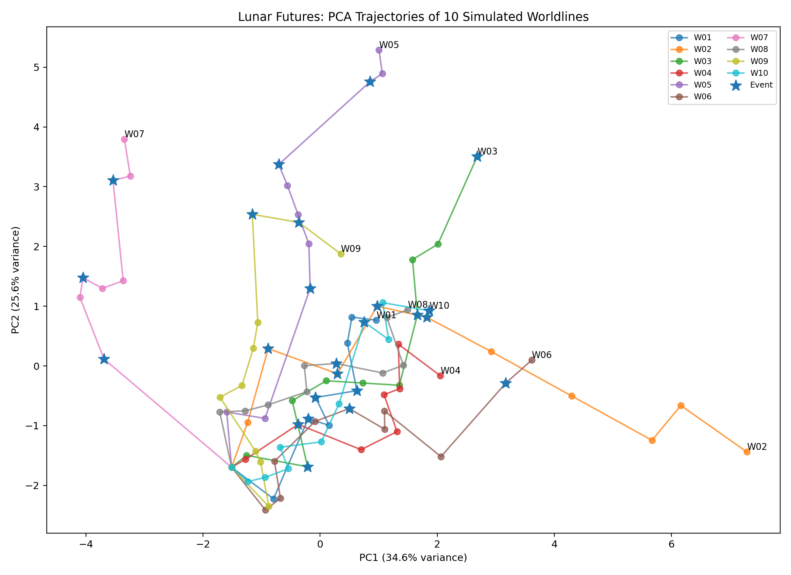

# Lunar Futures

**LLMマルチエージェント・シミュレーションによる「Rare Future」の探索**

Lunar Futures
は、月面南極域を舞台に、複数の国家・組織が資源、インフラ、科学、安全保障などをめぐって相互作用する未来を、LLMエージェントによって多数生成・解析する実験的なシミュレーションです。

本プロトタイプでは、**米国・中国・日本**をそれぞれ異なる目標や戦略を持つLLMエージェントとして実装し、同一の初期条件から複数の「世界線」を生成します。

目的は、もっとも起こりやすい未来を一つ予測することではありません。多数の試行の中から、通常の競争・対立シナリオとは異なる方向へ進んだ**稀だが望ましい未来（Rare
Future）**を見つけ、その世界線が成立した条件を逆向きに読み解くことです。

## コンセプト：Rare Futures

通常のシナリオ分析では、

> 「将来、何が起こりそうか？」

を考えます。

Lunar Futures では、それに加えて、

> **「多数の未来を試したとき、稀ではあるが望ましい世界線は存在するか？
> その未来は、なぜ実現したのか？」**

を問いかけます。

多くの試行では、資源確保、監視強化、陣営化などによって、米中間の競争が強まる可能性があります。一方で、事故、科学的発見、新技術、第三勢力の台頭などをきっかけとして、ごく一部の世界線が協調や共有インフラの形成へ向かう可能性があります。

本プロジェクトでは、そのような「主流から外れた世界線」を探索し、さらにその分岐点を遡ることで、**望ましい未来を偶然に任せず、あらかじめ設計するためのヒント**を得ることを目指します。

## 現在のプロトタイプ

現在は3つのLLMエージェントを実装しています。

  ----------------------------------------------------------------------------------------------------------------------------------
  エージェント                        単純化した役割
  ----------------------------------- ----------------------------------------------------------------------------------------------
  米国                                月面資源へのアクセスを確保し、競争相手による戦略的優位を防ぐ

  中国                                長期的な資源アクセスと重要な月面インフラを確保する

  日本                                持続可能な月面開発を促進しつつ、共有インフラや信頼されるサービスの提供者として存在感を高める
  ----------------------------------------------------------------------------------------------------------------------------------

各エージェントは、各ターンで状況を読み取り、例えば以下の行動から一つを選択します。

-   資源区域の確保
-   監視活動の強化
-   共同資源開発の提案
-   共同救難ネットワークの提案
-   科学データの共有
-   火星探査への投資
-   連合・第三勢力の形成
-   静観

現在のプロトタイプでは、ローカルLLMとして **Ollama + Qwen3 8B**
を使用しています。

## 世界状態（World State）

各ターンの社会状況を、多次元の状態ベクトルとして記録します。

現在は主に以下の変数を使用しています。

-   米中緊張度
-   共有インフラ
-   科学的オープンネス
-   火星進出の進展
-   中立的な資源・インフラへのアクセス
-   米国の国力
-   中国の国力
-   米国世論の協調志向
-   中国世論の協調志向
-   第三勢力の強さ
-   国際的な信頼

これらは現時点では意図的に単純化した指標です。

本プロトタイプの目的は、現実の国際情勢を正確に予測することではなく、**LLMエージェントの相互作用から多様な未来軌跡を生成し、それを解析可能な状態空間として表現できるか**を検証することにあります。

## Event Agent：未来への「ガチャ」

各ターンでは、外部イベントの発生判定も行います。

多くのターンでは大きなイベントは起こりませんが、低確率で例えば以下のような事象が発生します。

-   地球上での米中関係悪化
-   月面氷資源の新規発見
-   月面基地での重大事故
-   インドによる低コスト月輸送の成功
-   日本による重要技術のブレークスルー
-   月面での重要な科学的発見
-   火星探査を加速する技術的ブレークスルー
-   あらかじめ想定されていないRare Event

重要なのは、**イベントそのものが未来を決定するわけではない**ことです。

同じ事故や資源発見が起きても、それに対して米国、中国、日本のエージェントがどう反応するかによって、その後の世界線は変化します。

例えば基地事故は、国際救助による信頼形成にも、政治的取引にも、対立の激化にもつながり得ます。

## シミュレーションの流れ

``` text
同じ初期状態
      |
      v
外部イベント判定
      |
      v
米国エージェントが行動
      |
      v
中国エージェントが行動
      |
      v
日本エージェントが行動
      |
      v
世界状態が変化
      |
      v
地球側の国力・世論等も変化
      |
      v
次のターン
```

この繰り返しによって、一つの「世界線」が生成されます。

さらに、同じ初期状態からシミュレーション全体を繰り返すことで、多数の異なる未来を生成します。

## 初期試行：10本の世界線

Proof of Concept として、同じ初期条件から
**10本の世界線**を生成しました。

各ターンの世界状態を記録し、11個の状態変数を標準化したうえで、主成分分析（PCA）によって2次元へ縮約しました。

初期試行では、

-   PC1：約 **34.6%**
-   PC2：約 **25.6%**

の分散を説明し、2軸だけで全体の変動の約60%を表現できました。

同一の初期条件から開始しているにもかかわらず、世界線は次第に異なる方向へ分岐しました。

高緊張・資源囲い込み方向へ進む世界線がある一方、共有インフラ、国際的信頼、協調が高まる方向へ進む世界線も観察されました。また、外部イベントが発生したターンを軌跡上に重ねることで、**どの時点で世界線が主流から逸脱し始めたか**を追跡できます。



この10試行はあくまで概念実証であり、結果を現実の地政学的予測として解釈するものではありません。

## 「外れ値」から成功条件を探す

最終的に探したいのは、単なる統計的外れ値ではありません。

注目する世界線は、

**Novelty（新規性）**\
他の多くの世界線がほとんど到達しない状態空間へ進んでいる。

**Desirability（望ましさ）**\
低い緊張、高い国際的信頼、中立アクセス、共有インフラ、科学的オープンネス、深宇宙探査の進展などを実現している。

という2つの条件を満たすものです。

概念的には、

``` text
Rare Future Score ≈ Novelty × Desirability
```

として評価できます。

Rare Future候補が見つかったら、その世界線を逆向きにたどります。

``` text
Rare Future
    ↑
共有インフラ・協調体制の成立
    ↑
危機後の予想外の協力
    ↑
政策判断・第三勢力の介入
    ↑
外部イベント
    ↑
それ以前の社会・政治状態
```

多数の成功世界線を比較することで、

> **「どのような条件や介入が、望ましい未来への分岐確率を高めるのか？」**

を探索することが、このプロジェクトの中心的なアイデアです。

## なぜGPUサーバーが必要か

現在の実験は、小規模なローカルLLMと少数のエージェント・世界線によるプロトタイプです。

次の段階では、GPU計算資源を利用して以下へ拡張したいと考えています。

-   数百〜数千本の世界線の並列生成
-   より長期間のシミュレーション
-   より多様な外部イベント
-   国家内部の複数エージェント化
-   インド、欧州、民間企業、国際機関などの追加
-   エージェントの記憶と交渉履歴
-   LLM自身によるRare Event生成
-   PCA / UMAPによる未来状態空間の可視化
-   世界線のクラスタリング
-   状態空間の密度推定
-   Rare Futureの自動検出
-   成功世界線のバックトラッキング
-   条件を変えた多数の反実仮想シミュレーション

大規模な並列推論が可能になれば、現在の10本程度の試行から、**「未来の状態空間そのものを探索する」シミュレーション**へ発展させることができます。

## Repository構成

``` text
lunar-futures/
├── README.md
├── README_JAPANESE.md
├── agents.json
├── simulation.py
├── batch_simulation.py
├── plot_futures.py
├── results/
│   ├── lunar_futures_10_worldlines_pca.png
│   ├── lunar_futures_10_worldlines_pca.csv
│   └── lunar_futures_pca_loadings.csv
└── runs/
    └── example simulation logs
```

## 実行環境

-   Python 3
-   Ollama
-   Qwen3 8B
-   requests
-   pandas
-   scikit-learn
-   matplotlib

Pythonパッケージ：

``` bash
python -m pip install requests pandas scikit-learn matplotlib
```

Ollamaでモデルを準備：

``` bash
ollama pull qwen3:8b
```

単一世界線の実行：

``` bash
python simulation.py
```

複数世界線の実行：

``` bash
python batch_simulation.py
```

状態空間の可視化：

``` bash
python plot_futures.py
```

## Trial1-1000x production snapshot

Trial1-1000xは、従来の100-worldline Trial1を**1,000 worldlines**へ拡張した、
再現可能なproduction snapshotです。

-   1,000 worldlines × 10 turns
-   各turnでUSA → China → Japanの順に3 Agentが意思決定
-   LLMによる意思決定30,000件
-   7 × NVIDIA RTX A5000
-   7個の独立Ollama replicaによるworldline単位の並列化
-   Model: Qwen3 8B, Q4_K_M
-   Master seed: `20260821`
-   run IDの欠番・重複なし
-   全runがmerge validationに合格
-   `merged/all_states.csv`: 11,000 state rows

### Fixed provenance（固定した来歴情報）

-   Ollama version: `0.32.15`
-   Ollama image:
    `ollama/ollama@sha256:57d60e686821ea81a7748a3ec8141308c8b8f95b27105713954abf7a6529e700`
-   Qwen3 8B model digest:
    `500a1f067a9f782620b40bee6f7b0c89e17ae61f686b92c24933e4ca4b2b8b41`
-   Model format / quantization: GGUF, Q4_K_M, 8.2B parameters
-   Master seed: `20260821`
-   記録済み設定: `production-1000-lock.json`

production実行前に、7 replicaすべてが同一のOllama imageとmodel digestを
使用していることを確認しています。

### Results（成果物）

Gitで管理する軽量な統合結果は次の2ファイルです。

-   `artifacts/production-1000/merged/all_states.csv`
-   `artifacts/production-1000/merged/manifest.json`

1,000個すべてのrun JSONは、GitHub Release asset
`lunar_futures_production1000_results.tar.gz`として配布します。archive、
各run JSON、merged resultのSHA-256は`Trial1-1000x.SHA256SUMS`に記録しています。

### Reproduction（再現方法）

`.env.7gpu.example`を`.env.7gpu`へコピーして7個のGPU UUIDを設定し、
digest固定済みのOllama replicaを起動します。

``` bash
sudo docker compose --env-file .env.7gpu \
  -f compose.ollama-7gpu.yaml up -d
```

各replicaのmodel volumeに`qwen3:8b`が存在することを確認した後、7 workerと
検証付きmergeを実行します。

``` bash
NUM_RUNS=1000 \
NUM_TURNS=10 \
MASTER_SEED=20260821 \
MODEL=qwen3:8b \
EXPERIMENT_DIR="$PWD/artifacts/production-1000" \
scripts/run_7_workers.sh
```

別ターミナルから進捗を確認できます。

``` bash
scripts/progress.sh artifacts/production-1000
```

Release archiveを取得し、その成果物をリポジトリ内の対応する配置へ展開した後、
snapshot全体を検証します。

``` bash
sha256sum -c Trial1-1000x.SHA256SUMS
```

### Summary（主要結果）

1,000本のsimulationにおける最終的なgeopolitical tensionは平均78.43、
中央値83で、trustの平均は44.60でした。「米中冷戦化」に相当する探索的な
**複合判定基準**として、次の3条件をすべて満たす場合を定義しました。

-   tension >= 80
-   trust <= 40
-   neutral access <= 10

この基準では1,000 worldlines中273本、27.3%がcold-war-like outcomeに
分類されました。この27.3%は**将来の予測確率ではありません**。このmodel、
Agent prompt、状態遷移ルール、event確率、production configurationに固有の
simulation outcomeです。

行動傾向として、USAは監視拡大、Chinaは領有権主張、Japanは救助行動を最も
多く選択しました。これらも現実世界の行動予測ではなく、この探索的simulation
configurationから得られた出力として解釈する必要があります。

## 現在の位置づけ

本リポジトリは**ハッカソン向けの初期プロトタイプ**です。

現段階では、状態遷移ルール、エージェントプロンプト、イベント確率、状態変数はいずれも探索的・単純化されたものです。また、結果にはLLMの判断だけでなく、人為的に設定した状態遷移ルールの影響も含まれています。

したがって、今後は試行数の拡大だけでなく、

-   パラメータ感度解析
-   プロンプト依存性の評価
-   LLMモデル間比較
-   イベント頻度の比較
-   状態遷移ルールの検証
-   内生的なエージェント行動と外生的ルールの分離

などを進める必要があります。

## Vision

このプロジェクトの目的は、LLMに「未来を予言させる」ことではありません。

多数のAIエージェントに多様な未来を生きてもらい、その中から通常とは異なるが望ましい世界線を見つけ、

> **「この未来が可能になったのは、何が起きたからなのか？」**

を逆向きに探索することです。

月面南極は、そのための具体的なテストベッドです。

将来的には、宇宙社会だけでなく、多数の人・組織・技術・制度・偶発的イベントが複雑に相互作用する社会システム全般への応用も想定しています。

**多数の未来を生成する。\
稀な「良い未来」を見つける。\
その世界線を逆向きにたどる。**
